# Simplified LangChain Agents Workflow

## Core Workflow Diagram

```mermaid
flowchart TD
    A[📦 Install Dependencies] --> B[🔧 Setup Tools]
    B --> C[🤖 Configure Agent]
    C --> D[💬 Execute Queries]
    D --> E[✅ End]

    %% Tool Setup
    B --> B1[📚 Wikipedia Tool]
    B --> B2[📄 ArXiv Tool]
    B1 --> B3[📋 Combine Tools]
    B2 --> B3

    %% Agent Setup
    C --> C1[🔑 Load Environment]
    C --> C2[🧠 Initialize LLM]
    C --> C3[📝 Create Prompt]
    C --> C4[⚙️ Build Agent]
    C1 --> C5[🚀 Agent Executor]
    C2 --> C5
    C3 --> C5
    C4 --> C5

    %% Query Execution
    D --> D1[❓ User Query]
    D1 --> D2[🤔 Agent Reasoning]
    D2 --> D3[🔍 Tool Selection]
    D3 --> D4[📡 API Call]
    D4 --> D5[📊 Process Results]
    D5 --> D6[🔄 Refine if Needed]
    D6 --> D7[💡 Final Answer]
    D6 --> D2

    %% Styling
    classDef setup fill:#e3f2fd
    classDef tool fill:#f3e5f5
    classDef agent fill:#e8f5e8
    classDef query fill:#fff3e0

    class A setup
    class B,B1,B2,B3 tool
    class C,C1,C2,C3,C4,C5 agent
    class D,D1,D2,D3,D4,D5,D6,D7 query
```



## Step-by-Step Process

### 1. **Setup Phase** 📦
```python
# Install required packages
%pip install wikipedia arxiv langchainhub
```

### 2. **Tool Configuration** 🔧
```python
# Wikipedia Tool
wiki_tool = WikipediaQueryRun(api_wrapper=WikipediaAPIWrapper(
    top_k_results=1, 
    doc_content_chars_max=200
))

# ArXiv Tool  
arxiv_tool = ArxivQueryRun(api_wrapper=ArxivAPIWrapper(
    top_k_results=1, 
    doc_content_chars_max=200
))

# Combine tools
tools = [wiki_tool, arxiv_tool]
```

### 3. **Agent Setup** 🤖
```python
# Load environment & LLM
load_dotenv()
llm = ChatAnthropic(model="claude-3-5-sonnet-20240620", temperature=0)

# Create prompt template
prompt = ChatPromptTemplate.from_messages([
    ("system", "You are a helpful assistant with access to tools..."),
    ("user", "{input}"),
    ("placeholder", "{agent_scratchpad}"),
])

# Build agent
agent = create_tool_calling_agent(llm, tools, prompt)
agent_executor = AgentExecutor(agent=agent, tools=tools, verbose=True)
```

### 4. **Query Execution Flow** 💬

#### Example: "Who is the CEO of Tesla?"


## Key Components

| Component | Purpose | Example |
|-----------|---------|---------|
| **Wikipedia Tool** | Search general knowledge | Company info, people, places |
| **ArXiv Tool** | Search research papers | Academic papers, authors, citations |
| **Claude 3.5 Sonnet** | Reasoning & tool selection | Decides which tool to use |
| **Agent Executor** | Orchestrates the process | Manages tool calls & responses |

## Agent Decision Making


## Execution Examples

### ✅ Successful Query
- **Input**: "Who are the authors of BranchyNet paper?"
- **Tool Used**: ArXiv
- **Process**: Initial search → Refined search → Found paper → Extracted authors
- **Output**: "Surat Teerapittayanon, Bradley McDanel, H. T. Kung"

### ⚠️ Limited Query  
- **Input**: "How many papers are based on BranchyNet?"
- **Tool Used**: ArXiv
- **Process**: Multiple searches → Limited results → Explained limitations
- **Output**: "Only found original paper, need broader search capabilities"

## Benefits of This Architecture

1. **🔄 Iterative Refinement**: Agent can refine searches when initial results are insufficient
2. **🎯 Smart Tool Selection**: Automatically chooses the most appropriate tool
3. **📊 Transparent Process**: Verbose logging shows reasoning steps
4. **🛡️ Error Handling**: Gracefully handles limitations and explains them
5. **🔧 Extensible**: Easy to add new tools to the system

This workflow demonstrates a production-ready LangChain agent system that can handle complex queries by intelligently selecting and using multiple external data sources. 